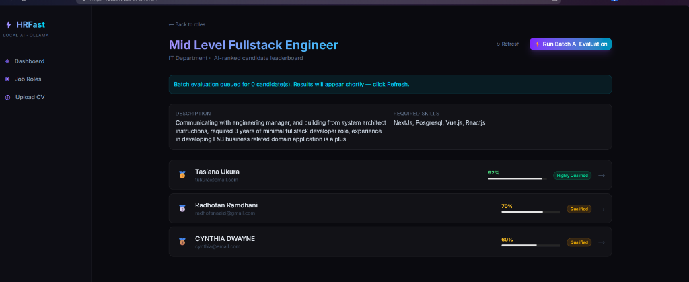
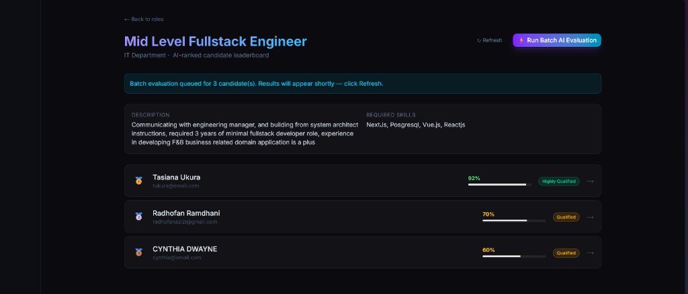
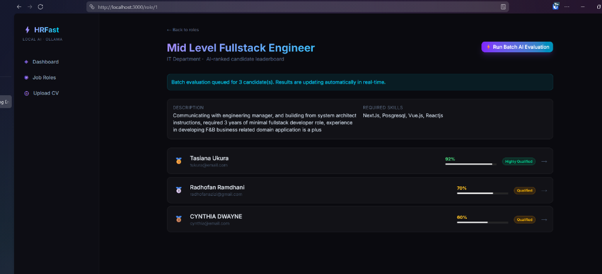
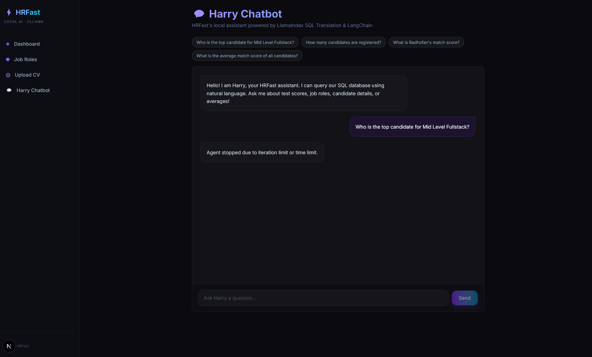
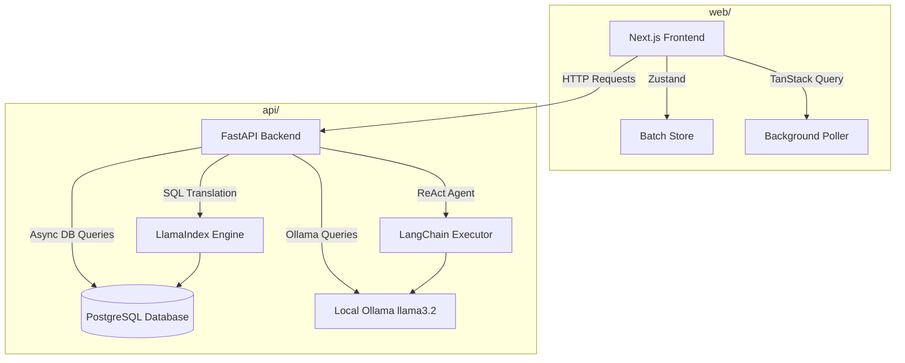

# HRFast - Local AI CV Ranking Engine

HRFast is a local Applicant Tracking System powered by **Ollama**, **FastAPI**, **PostgreSQL**, and **Next.js**. It lets recruiters manage job roles, upload candidate resumes, automatically extract details, perform local AI evaluations to rank candidates on interactive leaderboards, and converse with an AI assistant chatbot.

### Dashboard overview



### Upload resumes and auto-fill details



### Candidate leaderboard and AI evaluation reports



### Harry Chatbot Assistant



---

## System Architecture



---

## What You Can Do

- **Job Openings**: Manage job openings and role descriptions.
- **Resume Uploads**: Drag-and-drop PDF resumes to import them.
- **Auto-Extraction**: Automatically parse candidate first name, last name, email, and phone numbers during upload.
- **Batch Evaluation**: Run batch AI evaluations to score all resumes against job requirements.
- **Leaderboard**: View ranked candidate leaderboards based on match scores.
- **Detailed Reports**: Inspect detailed AI justifications and identified skills for each candidate.
- **Harry Chatbot**: Converse with an AI assistant about candidates, match scores, role counts, or statistics.

---

## Tech Stack

| Layer         | Technology                                                            |
| ------------- | --------------------------------------------------------------------- |
| **Frontend**  | Next.js (App Router), React, Tailwind CSS, Shadcn UI                  |
| **State/Query**| TanStack Query (React Query), Zustand                                |
| **Backend**   | FastAPI (Python 3.10+), SQLAlchemy                                    |
| **AI Framework**| LangChain (ReAct Agent & Tooling), LlamaIndex (SQL NL Query Engine)  |
| **Database**  | PostgreSQL (on Windows via Scoop)                                     |
| **AI Engine** | Ollama (Llama 3.2 / local model)                                      |

---

## Local Setup

### 1. Database Configuration (Windows via Scoop)

Scoop PostgreSQL runs on **Windows**.

```powershell
# Windows PowerShell — start Postgres
pg_ctl start -D "%PGDATA%"

# Create the database
psql -U postgres -c "CREATE DATABASE hr_ats_db;"
```

#### Allow local connections in pg_hba.conf
Ensure your Scoop PostgreSQL `pg_hba.conf` contains:
```
host    all    all    0.0.0.0/0    trust
```
And `postgresql.conf` has:
```
listen_addresses = '*'
```
Then restart Postgres: `pg_ctl restart -D "%PGDATA%"`.

### 2. Ollama Setup

```bash
# Install Ollama
curl -fsSL https://ollama.com/install.sh | sh

# Pull the model (llama3.2 recommended)
ollama pull llama3.2

# Start Ollama server (runs on http://localhost:11434)
ollama serve
```

### 3. Backend Setup

```powershell
# Navigate to the api directory
cd api

# Create virtual environment
python -m venv .venv
.venv\Scripts\activate

# Install dependencies
pip install -r requirements.txt

# Start the API server
uvicorn src.main:app --reload --host 0.0.0.0 --port 8000
```

The API is live at `http://localhost:8000`. Interactive docs: `http://localhost:8000/docs`.

### 4. Frontend Setup

```powershell
# Windows PowerShell
cd web

# Install dependencies and start dev server
npm install
npm run dev
```

The frontend is live at `http://localhost:3000`.

---

## Main Routes

| Path           | Purpose                                                  |
| -------------- | -------------------------------------------------------- |
| `/`            | Dashboard overview showing stats                         |
| `/roles`       | List of job openings and create role form                |
| `/upload`      | Resume upload zone with automatic candidate auto-fill    |
| `/role/{id}`   | Ranked candidate leaderboard and AI evaluation summaries |
| `/chatbot`     | Harry Chatbot workspace interface                        |

---

## Troubleshooting

- **`asyncpg` cannot connect to PostgreSQL**: Check your local PostgreSQL setup. Verify `pg_hba.conf` allows the connection.
- **Ollama returns timeout**: Make sure `ollama serve` is running. Check `http://localhost:11434` responds.
- **`pdfplumber` extraction fails**: The service falls back to PyPDF2 automatically. If both fail, the PDF may be image-only (scanned) without extractable text.
