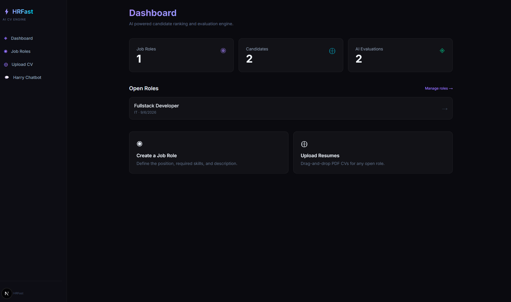
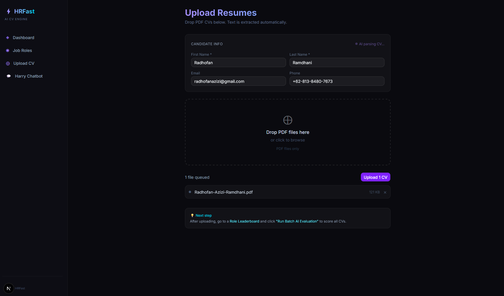
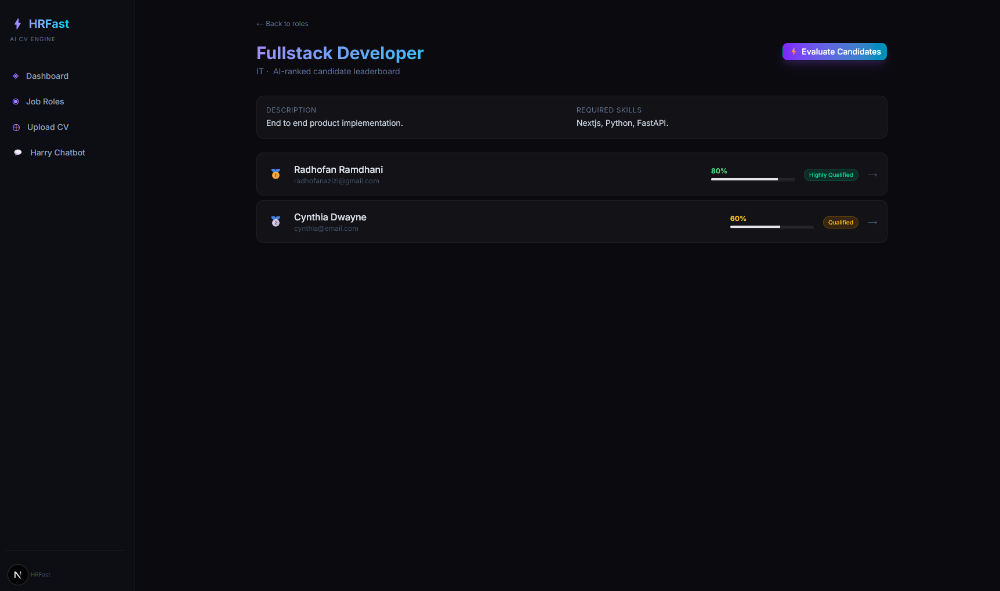
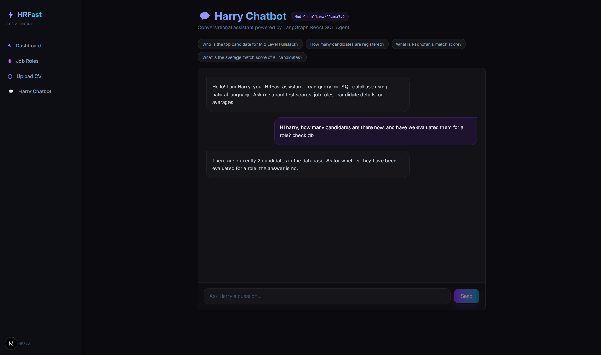
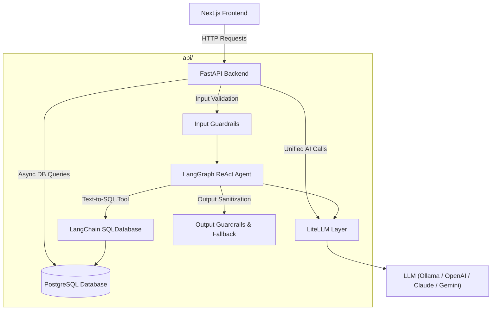

# HRFast - AI CV Ranking Engine

HRFast is an Applicant Tracking System powered by **LLM API**, **FastAPI**, **PostgreSQL**, and **Next.js**. It lets recruiters manage job roles, upload candidate resumes, automatically extract details, perform AI evaluations to rank candidates on interactive leaderboards, and converse with an AI assistant chatbot.

### Dashboard overview



### Upload resumes and auto-fill details



### Candidate leaderboard and AI evaluation reports



### Harry Chatbot Assistant



---

## System Architecture


```mermaid
graph TD
    Client["Next.js Frontend"] -->|HTTP Requests| API["FastAPI Backend"]
    API -->|Async DB Queries| DB[("PostgreSQL Database")]
    API -->|Unified AI Calls| LiteLLM["LiteLLM Layer"]
    LiteLLM --> LLM["LLM (Ollama / OpenAI / Claude / Gemini)"]

    subgraph Backend ["api/"]
        API -->|Input Validation| GuardrailsIn["Input Guardrails"]
        GuardrailsIn --> Agent["LangGraph ReAct Agent"]
        Agent -->|Text-to-SQL Tool| SQLTool["LangChain SQLDatabase"]
        SQLTool --> DB
        Agent --> LiteLLM
        Agent -->|Output Sanitization| GuardrailsOut["Output Guardrails & Fallback"]
    end
```

---

## What You Can Do

- **Job Openings**: Manage job openings and role descriptions.
- **Resume Uploads**: Drag-and-drop PDF resumes to import them.
- **Auto-Extraction**: Automatically parse candidate first name, last name, email, and phone numbers during upload.
- **Batch Evaluation**: Run batch AI evaluations to score all resumes against job requirements.
- **Leaderboard**: View ranked candidate leaderboards based on match scores.
- **Detailed Reports**: Inspect detailed AI justifications and identified skills for each candidate.
- **Harry Chatbot**: Converse with an AI assistant about candidates, match scores, role counts, or statistics.
- **Safety and Reliability**: Guardrails AI input/output validation, prompt injection prevention, and bounded retries with fallback response handling.

---

## Tech Stack

| Layer            | Technology                                                                |
| ---------------- | ------------------------------------------------------------------------- |
| **Frontend**     | Next.js (App Router), React, Tailwind CSS, Shadcn UI                      |
| **State/Query**  | TanStack Query (React Query), Zustand                                     |
| **Backend**      | FastAPI (Python 3.10+), SQLAlchemy                                        |
| **AI Framework** | LangChain & LangGraph (ReAct Agent & SQL Tools), Guardrails AI            |
| **LLM Gateway**  | LiteLLM (Unified multi-provider interface: Ollama, OpenAI, Claude, etc.)  |
| **Database**     | PostgreSQL (on Windows via Scoop)                                         |
| **AI Engine**    | Local Ollama (`ollama/llama3.2` default) or Cloud Providers (GPT, Claude) |

---

## Local Setup

### 1. Database Configuration (Windows via Scoop)

Scoop PostgreSQL runs on **Windows**.

```powershell
# Windows PowerShell: start Postgres
pg_ctl start -D "%PGDATA%"

# Create the database
psql -U postgres -c "CREATE DATABASE hr_ats_db;"
```

#### Allow local connections in pg_hba.conf

Ensure your Scoop PostgreSQL `pg_hba.conf` contains:

```
host    all    all    0.0.0.0/0    trust
```

And `postgresql.conf` has:

```
listen_addresses = '*'
```

Then restart Postgres: `pg_ctl restart -D "%PGDATA%"`.

### 2. Ollama Setup

```bash
# Install Ollama
curl -fsSL https://ollama.com/install.sh | sh

# Pull the model (llama3.2 recommended)
ollama pull llama3.2

# Start Ollama server (runs on http://localhost:11434)
ollama serve
```

### 3. Backend Setup

```powershell
# Navigate to the api directory
cd api

# Create virtual environment
python -m venv .venv
.venv\Scripts\activate

# Install dependencies
pip install -r requirements.txt

# Configure environment variables (.env)
# Default is local Ollama (ollama/llama3.2). For OpenAI, Claude, or Gemini, update api/.env:
# LLM_MODEL=ollama/llama3.2
# OPENAI_API_KEY=sk-...

# Start the API server
uvicorn src.main:app --reload --host 0.0.0.0 --port 8000
```

The API is live at `http://localhost:8000`. Interactive docs: `http://localhost:8000/docs`.

### 4. Frontend Setup

```powershell
# Windows PowerShell
cd web

# Install dependencies and start dev server
npm install
npm run dev
```

The frontend is live at `http://localhost:3000`.

---

## Main Routes

| Path         | Purpose                                                  |
| ------------ | -------------------------------------------------------- |
| `/`          | Dashboard overview showing stats                         |
| `/roles`     | List of job openings and create role form                |
| `/upload`    | Resume upload zone with automatic candidate auto-fill    |
| `/role/{id}` | Ranked candidate leaderboard and AI evaluation summaries |
| `/chatbot`   | Harry Chatbot workspace interface                        |

---
